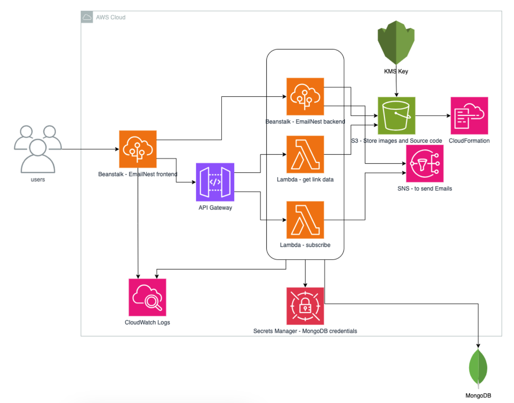

# EmailNest

## Project Overview
EmailNest application can be used by anyone who wants to connect with their audience through email. It helps users to create links which they can share with their audience. The user will have to put information like title, subtitle, logo (which will be used to create an email capture page) and redirect url to create a new link. Redirect url is where their audience will be redirected after taking their email. So if the user wants to share some amazon product link with their audience but at the same time they want that their user give their email id first before redirecting to the actual product. So they’ve all the email of their subscribers and then they can send more newsletter to their audience. The user should be able to get their subscriber list without taking much time but at the same time, their audience will be larger so the email capture page should load in no time providing seamless experience to their audience as well. Once the user has their subscribers' emails, they can send their message/newsletter directly to them.

## Technology Overview
 - **Frontend**: `React`, deployed on `AWS Elastic Beanstalk`
 - **Backend**: `Nodejs`,  deployed on `AWS Elastic Beanstalk` and lambda functions deployed on `AWS Lambda` & Exposed via `AWS API Gateway`
 - **Storage**: `AWS S3` to store brand logo, `MongoDB` to store Link metadata
 - **Secret Manager**: `AWS Secrets Manager` to store Database credentials securily. 
 - **Email**: `Amazon Simple Notification Service (SES)` 
 - For **Infrastructure as Code (IaC)**: `AWS CloudFormation` 
 - **Logging**: `AWS CloudWatch`

## Architecture

## Future Enhancements
 - Use `AWS Simple Email Service` to send newsletters.
 - CI/CD pipeline  
 - Private VPC and Subnets to increase security
 - `AWS Cognito` or `Firebase Authentication` for user management